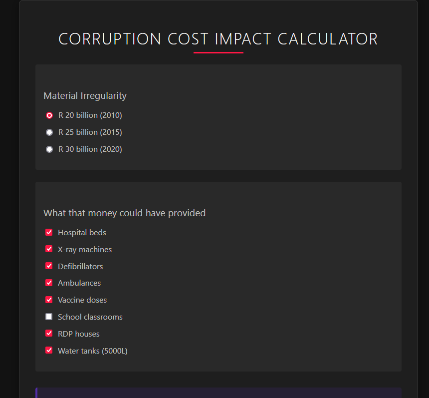

# Corruption Calculator

## Preview

    

 

## Alternative designs

This app was written in Vue.

A stylized version has been generated using a screenshot and AI, but that uses plain JavaScript.

See the code here [plain-js-apps](plain-js-apps) and previews below:

### Basic styling

Downloaded from https://websim.ai/p/j1sd4xzlvyqtgin1m1pl/1

### Dark style

Downloaded from https://websim.ai/@MichaelPythonDev/corruption-cost-impact-calculator

## Documentation
> How to install, run and deploy this project

## License

Released under [MIT](/LICENSE) by [@MichaelCurrin](https://github.com/MichaelCurrin).
